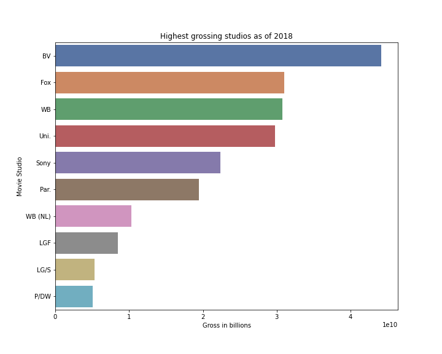
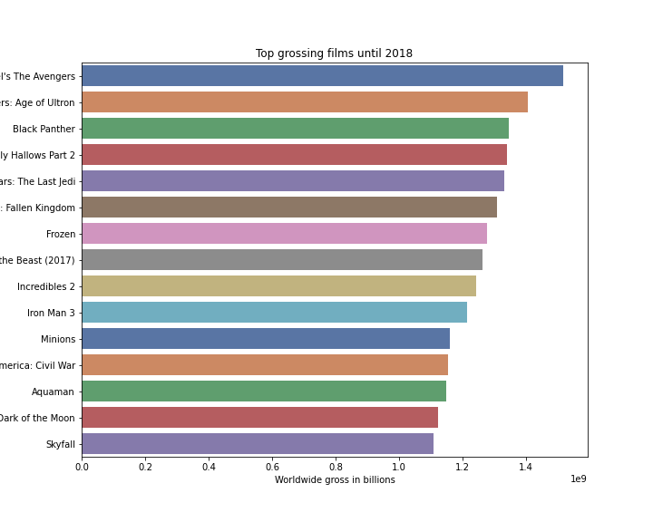

# Movie Analysis for Microsoft

The aim of this repository is to analyze movies and figure out business recommendations for Microsoft. We will be working with data from multiple sources including:

1. Box Office Mojo
2. IMdB

We have a lot of different csv files which can be found in the ```zipped_data``` folder.

We have come up with three business recommendations for Microsoft as listed below. 

The analysis was performed using python and the code can be found in ```student.ipynb```

# Business problem

Analyzing movies until 2018 to come up with business recommendations for Microsoft. We will be looking at the most popular films, the most profitable studios and we will also look at the most popular directors by num of votes for their films. We hope to provide Microsoft with an idea of which studio and director should they work with or investigate more for their movie industry debut.

# Data 

The data was provided to me by Flatiron school and comes from various sources. I leveraged the ```glob``` library to read all the csv files. Most of the analysis was done was data sourced from IMdB and Box Office Mojo.

We had movies until 2018. We also had movie gross data, production companies and list of cast and crew.

# Results

## Disney and Fox are the highest grossing studios



We can clearly see that Disney is the highest grossing studio with more than \\$4 billon earned till 2018. Fox and WB come in a close second and third with grosses of nearly $3 billion.

**We recommend that Microsoft work with one of these 3 studios as they clearly have delivered a consistent and solid performance at the box office.**

We also took a look at the highest grossing movies till 2018 and saw a lot of Disney and Fox movies appearing in the top 15.



# Command to convert jupyter notebook to markdown file

jupyter nbconvert --to markdown notebookname.ipynb


```python

```
